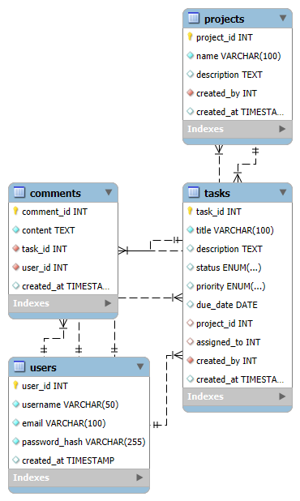

```markdown
# 📋 Task Manager API with MySQL

## 🌟 Project Overview

A **production-ready** Task Manager API built with FastAPI and MySQL featuring complete CRUD operations across 4 relational tables with proper authentication and data relationships.

---

## ✨ Key Features

### 👥 User Management
| Feature | Description |
|---------|-------------|
| 🔐 Registration | Secure user signup with email validation |
| 🔒 Authentication | Password hashing with industry standards |
| 👤 Profile Management | Update user details and preferences |

### ✅ Task System
| Feature | Description |
|---------|-------------|
| 📝 CRUD Operations | Full create, read, update, delete functionality |
| 🚦 Status Tracking | `pending` → `in_progress` → `completed` workflow |
| ⚡ Priority Levels | `low`/`medium`/`high` priority classification |
| 📅 Due Dates | Deadline management with calendar integration |

### 🗂️ Category Organization
```diff
+ Many-to-many relationships between tasks and categories
+ User-specific category organization
+ Dynamic filtering by category
```

---

## 🛠 Tech Stack

<div align="center">

| Layer        | Technology                          |
|--------------|-------------------------------------|
| **Backend**  | Python FastAPI                      |
| **Database** | MySQL 8.0+                          |
| **ORM**      | MySQL Connector/Python              |
| **Auth**     | JWT Tokens                          |
| **Docs**     | Swagger UI & ReDoc                  |

</div>

---

## 🗃 Database Schema

```sql
-- Users Table
CREATE TABLE users (
    user_id INT AUTO_INCREMENT PRIMARY KEY,
    username VARCHAR(50) NOT NULL UNIQUE,
    email VARCHAR(100) NOT NULL UNIQUE,
    password_hash VARCHAR(255) NOT NULL,
    created_at TIMESTAMP DEFAULT CURRENT_TIMESTAMP
);

-- Tasks Table
CREATE TABLE tasks (
    task_id INT AUTO_INCREMENT PRIMARY KEY,
    title VARCHAR(100) NOT NULL,
    status ENUM('pending','in_progress','completed') DEFAULT 'pending',
    priority ENUM('low','medium','high') DEFAULT 'medium',
    user_id INT NOT NULL,
    FOREIGN KEY (user_id) REFERENCES users(user_id) ON DELETE CASCADE
);
```

[View Full Schema](#) | [Download SQL File](database/schema.sql)

---

## 🚀 Getting Started

### Prerequisites
- Python 3.9+
- MySQL 8.0+
- pipenv (recommended)

### Installation
```bash
# 1. Clone repository
git clone https://github.com/Liya-dotcom/task-manager-api.git
cd task-manager-api

# 2. Setup virtual environment
python -m venv venv
source venv/bin/activate  # Linux/MacOS
.\venv\Scripts\activate   # Windows

# 3. Install dependencies
pip install -r requirements.txt

# 4. Configure environment
cp .env.example .env
nano .env  # Edit with your credentials
```

### Database Setup
```bash
mysql -u root -p < database/schema.sql
```

### Running the API
```bash
uvicorn src.main:app --reload
```
> Access docs at: http://localhost:8000/docs

---

## 📡 API Endpoints

### Users
| Method | Endpoint | Description |
|--------|----------|-------------|
| `POST` | `/users` | Register new user |
| `GET`  | `/users/{id}` | Get user profile |

### Tasks
| Method | Endpoint | Description |
|--------|----------|-------------|
| `POST` | `/tasks` | Create new task |
| `GET`  | `/tasks/{id}` | Get task details |
| `PUT`  | `/tasks/{id}` | Update task |

[View Complete API Reference](#)

---

## 💡 Example Usage

### Create User
```bash
curl -X POST "http://localhost:8000/users/" \
  -H "Content-Type: application/json" \
  -d '{"username": "devuser", "email": "dev@example.com", "password": "S3cur3P@ss"}'
```

### Create Task
```javascript
fetch('/tasks', {
  method: 'POST',
  headers: { 'Content-Type': 'application/json' },
  body: JSON.stringify({
    title: 'Deploy API',
    description: 'Deploy to production server',
    priority: 'high'
  })
})
```

---

## 🏗 Project Structure

```
task-manager-api/
├── .env                    # Environment variables
├── requirements.txt        # Dependencies
├── database/
│   ├── schema.sql          # Database schema
│   └── erd.png             # ER diagram
└── src/
    ├── main.py             # FastAPI application
    ├── models/             # Database models
    └── routers/            # API endpoints
```
## 📊 Entity Relationship Diagram



```

